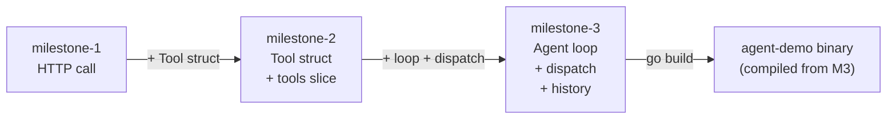
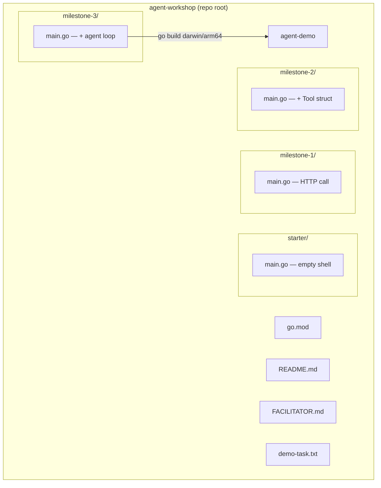

# Architecture Spine — agent_workshop

## Design Paradigm

**Progressive Disclosure.** The repo is a sequence of three complete, runnable snapshots. Each snapshot (milestone) reveals exactly one new concept; the attendee reads any snapshot in isolation without prior context. The reference binary is the full system — seen first as magic, decoded last as familiar code.



Each milestone = prior milestone + one concept block. Nothing removed. Nothing restructured.

## Invariants & Rules

### AD-1 — Additive-only milestone delta

- **Binds:** milestone-1, milestone-2, milestone-3
- **Prevents:** attendees losing orientation when diffing milestones; new concepts obscured by restructuring
- **Rule:** `milestone-N+1/main.go` = `milestone-N/main.go` + exactly one new contiguous concept block. No lines deleted, no reordering of existing code between milestones.

### AD-2 — Milestone isolation

- **Binds:** milestone-1, milestone-2, milestone-3, starter
- **Prevents:** import-graph coupling that forces a builder to understand a later milestone to read an earlier one
- **Rule:** Each milestone is a standalone Go program in its own directory. No shared packages, no cross-milestone imports. `go build ./milestone-1/` must compile without touching any other directory.

### AD-3 — Single-file per milestone

- **Binds:** milestone-1, milestone-2, milestone-3, starter
- **Prevents:** file navigation complexity distracting from the concept being introduced
- **Rule:** Each milestone contains exactly one file: `main.go`. No sub-packages, no `internal/`, no helper files.

### AD-4 — Ollama HTTP API only (no SDK)

- **Binds:** all milestone code, reference binary
- **Prevents:** one builder using the ollama-go client, another using raw HTTP — non-comparable code during the live session
- **Rule:** All model calls are `http.Post` to `http://localhost:11434/api/chat`. No LLM SDK, no framework import. stdlib only.

### AD-5 — Canonical Tool struct shape

- **Binds:** milestone-2, milestone-3, reference binary
- **Prevents:** divergent Tool shapes between milestones that break the additive delta invariant (AD-1)
- **Rule:** Tool struct has exactly these four fields, in this order:
  ```go
  type Tool struct {
      Name        string
      Description string
      Parameters  json.RawMessage
      Run         func(args map[string]any) string
  }
  ```
  No additional fields. `Parameters` holds the JSON Schema object passed to Ollama.

### AD-6 — Message history: in-memory slice, unbounded, non-persistent

- **Binds:** milestone-3, reference binary
- **Prevents:** one builder adding rolling-window truncation, another adding file persistence (both explicitly out of PRD scope)
- **Rule:** History is `[]Message` accumulated in the loop. Never truncated. Never written to disk. Cleared when the process exits.

### AD-7 — Stop condition: absence of tool_calls

- **Binds:** milestone-3, reference binary
- **Prevents:** alternative stop conditions (max-turns, timeout, error) being introduced — PRD explicitly defers these to post-workshop extension questions
- **Rule:** The agent loop exits when the model's response contains no `tool_calls` field (i.e., the model returns a plain text reply). No other stop condition in scope.

### AD-8 — Reference binary source and target

- **Binds:** FR-3, agent-demo binary
- **Prevents:** binary diverging from the milestone code attendees read
- **Rule:** The reference binary is compiled from `milestone-3/main.go` for `GOOS=darwin GOARCH=arm64` [ASSUMPTION: Thomas's machine is Apple Silicon]. Committed to repo root as `agent-demo`. No multi-arch distribution.

### AD-9 — Single go.mod at repo root, stdlib only

- **Binds:** all milestone code, starter, reference binary
- **Prevents:** per-milestone go.mod files complicating `go build` invocations; external dependency version drift during sessions
- **Rule:** One `go.mod` at repo root. Module path: `github.com/tclaudel/agent-workshop` [ASSUMPTION — confirm]. Zero external dependencies; stdlib only (`encoding/json`, `net/http`, `os`, `fmt`).

### AD-10 — Message struct shape

- **Binds:** milestone-2, milestone-3, reference binary
- **Prevents:** two builders choosing incompatible Message field names (Role/Content vs Author/Text) — struct mismatch breaks side-by-side diff at the live session
- **Rule:** Message struct has exactly these fields, in this order:
  ```go
  type Message struct {
      Role      string     `json:"role"`
      Content   string     `json:"content"`
      ToolCalls []ToolCall `json:"tool_calls,omitempty"`
  }
  ```
  `ToolCalls` is `nil` for user/system messages; populated only in assistant responses.

### AD-11 — Ollama envelope struct shapes

- **Binds:** all milestone code
- **Prevents:** one builder using typed request structs, another using `map[string]any` — both marshal identically but produce non-comparable source code
- **Rule:** Use typed Go structs for all Ollama request/response bodies (not `map[string]any`, not raw `[]byte` templates). Minimum required shapes:
  ```go
  type ChatRequest struct {
      Model    string    `json:"model"`
      Messages []Message `json:"messages"`
      Tools    []ToolDef `json:"tools,omitempty"`
      Stream   bool      `json:"stream"`
  }
  type ToolDef struct {
      Type     string       `json:"type"`
      Function ToolFunction `json:"function"`
  }
  type ToolFunction struct {
      Name        string          `json:"name"`
      Description string          `json:"description"`
      Parameters  json.RawMessage `json:"parameters"`
  }
  type ChatResponse struct {
      Message Message `json:"message"`
  }
  type ToolCall struct {
      Function ToolCallFunction `json:"function"`
  }
  type ToolCallFunction struct {
      Name      string         `json:"name"`
      Arguments map[string]any `json:"arguments"`
  }
  ```
  `ToolDef` wraps `Tool` (AD-5) for the Ollama wire format. `Tool.Run` is not serialized.

### AD-12 — Tool dispatch uses switch, not if/else or map

- **Binds:** milestone-3, reference binary
- **Prevents:** one builder using `switch`, another `if/else if`, another a `map[string]func` — structurally incompatible loops despite identical behavior; breaks line-by-line walkthrough in Phase 6
- **Rule:** Tool dispatch inside the agent loop uses a `switch msg.ToolCalls[0].Function.Name` statement. One `case` per tool name. No function-map dispatch pattern.

### AD-13 — HTTP client: http.Post shorthand

- **Binds:** all milestone code
- **Prevents:** one builder using `http.DefaultClient.Do()` with a manually built `http.Request`, another using `http.Post()` — different import lists, different error handling shape, breaks milestone-1 code comparison
- **Rule:** All Ollama calls use `http.Post(url, "application/json", body)`. No custom `http.Client` struct, no `http.NewRequest`, no timeout configuration in milestone code.

## Consistency Conventions

| Concern | Convention |
| --- | --- |
| Naming (files) | `main.go` in every milestone dir; binary committed as `agent-demo` at root |
| Naming (structs, funcs) | Match PRD glossary: `Tool`, `Message`, `agent loop` = `for` loop in main; `run` method on Tool = `Run` field |
| HTTP request shape | Ollama `/api/chat` with `stream: false`; request body marshalled from a Go struct, not a raw string |
| Tool dispatch | Switch on `tool_calls[0].function.name`; `read_file` and `write_file` are the two required tool names |
| Error handling | `log.Fatal` on hard errors (Ollama unreachable, JSON parse failure); no custom error types, no retries |
| Code comments | None in milestone code — clarity from naming only; comments belong in FACILITATOR.md and README |

## Stack

| Name | Version |
| --- | --- |
| Go | 1.22+ |
| Ollama | 0.3+ [UNVERIFIED — confirm min version for tool_calls support before session] |
| llama3.2 | 3B (via `ollama pull llama3.2`) [UNVERIFIED — confirm tool_calls support in this quantization] |
| OS (binary target) | darwin/arm64 [ASSUMPTION] |

## Structural Seed

```text
agent-workshop/
  go.mod                   # single module, stdlib only
  README.md                # prereq guide + walkthrough (FR-5)
  FACILITATOR.md           # talk-track, timing, pacing risks (FR-4)
  agent-demo               # reference binary, darwin/arm64 (FR-3)
  demo-task.txt            # [ASSUMPTION] task file used in minute-0/57 demo
  starter/
    main.go                # package + imports only — attendee start point (FR-2)
  milestone-1/
    main.go                # HTTP call to Ollama, prints reply (FR-1)
  milestone-2/
    main.go                # + Tool struct, read_file, write_file, tools slice (FR-1)
  milestone-3/
    main.go                # + agent loop, tool dispatch, message history (FR-1)
```



## Capability → Architecture Map

| Capability / FR | Lives in | Governed by |
| --- | --- | --- |
| FR-1: Progressive milestone code | milestone-1/, milestone-2/, milestone-3/ | AD-1, AD-2, AD-3 |
| FR-2: Starter file | starter/main.go | AD-2, AD-3 |
| FR-3: Reference binary | agent-demo (root) | AD-8 |
| FR-4: Facilitator guide | FACILITATOR.md | — (content only, no structural invariant) |
| FR-5: Prereq guide + Tool schema snippet | README.md | — |
| Tool struct contract | milestone-2/, milestone-3/ | AD-5 |
| Ollama call | all milestones | AD-4, AD-9 |
| Agent loop | milestone-3/ | AD-6, AD-7 |

## Deferred

- **Stop condition robustness** (max-turns, error, timeout) — PRD explicitly defers to post-workshop extension questions; not in scope for any milestone
- **Error handling patterns** — `log.Fatal` only; no retry/backoff decisions needed until a production variant is built
- **Multi-arch binary distribution** — deferred to v2 if workshop runs on non-Apple-Silicon machines
- **Slide deck structure** — out of scope per PRD; owned by Thomas separately
- **Automated prereq verification script** — deferred to v2 (FR-5 note)
- **Per-milestone README / inline code comments** — content decision, not structural; owned by implementation
