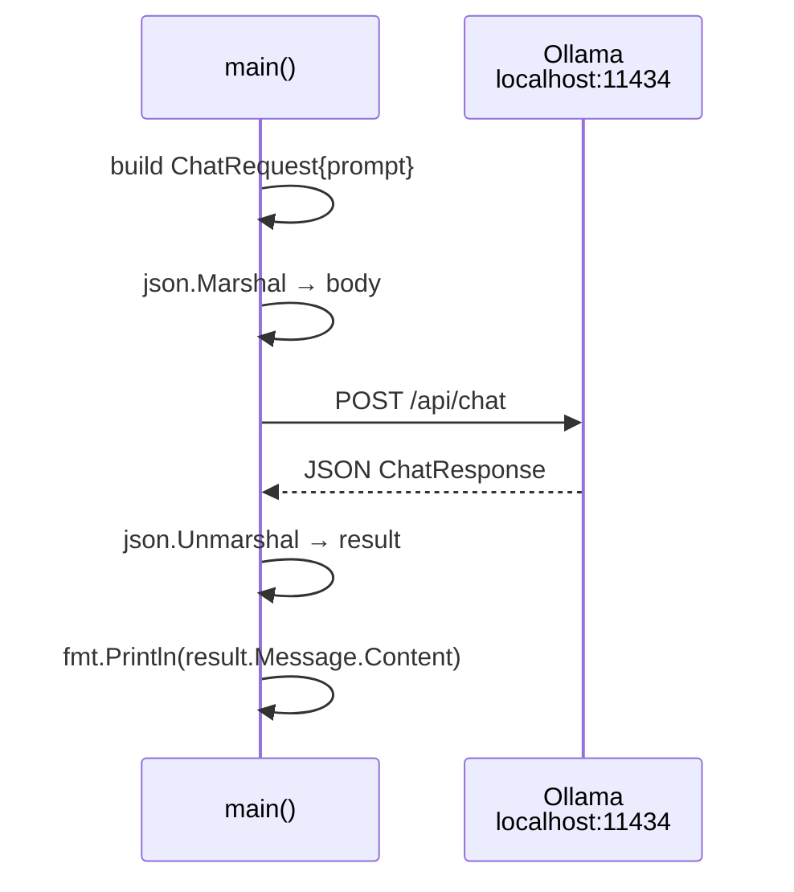

# Milestone 1 — One HTTP Call to the Model

> **New concept:** talk to a local LLM over HTTP. Send a prompt, print the reply. Nothing else.

This is the smallest possible "agent": a program that asks a model a question and shows the answer. Every later milestone is *this file plus one more idea*, so it pays to understand it completely.

---

## What it does

```
prompt ──► Ollama (llama3.2) ──► answer ──► stdout
```

The program hard-codes the question `"What is 2+2?"`, POSTs it to Ollama's chat endpoint, decodes the JSON reply, and prints the model's text.

---

## The data model

Ollama's `/api/chat` endpoint speaks JSON. We model just enough of it to send a request and read a response.

```go
type Message struct {
	Role    string `json:"role"`    // "user" | "assistant" | "system"
	Content string `json:"content"` // the text of the turn
}

type ChatRequest struct {
	Model    string    `json:"model"`    // "llama3.2"
	Messages []Message `json:"messages"` // conversation so far (here, one user turn)
	Stream   bool      `json:"stream"`   // false = wait for the full reply
}

type ChatResponse struct {
	Message Message `json:"message"`  // the model's reply turn
}
```

Three things to notice — they carry through the whole workshop:

| Field | Why it matters |
|-------|----------------|
| `Messages []Message` | A chat is a **list of turns**, not a single string. Milestone 3 grows this list to give the agent memory. |
| `Role` | Tells the model who said what. The first turn is always `"user"`. |
| `Stream: false` | We want one complete JSON object back, not a token-by-token stream — simpler to parse. |

---

## The flow



---

## Code walkthrough

```go
prompt := "What is 2+2?"

chatRequest := ChatRequest{
	Model:    "llama3.2",
	Messages: []Message{{Role: "user", Content: prompt}},
	Stream:   false,
}
```
Build the request. The conversation is a single user turn.

```go
body, err := json.Marshal(chatRequest)
// ...
resp, err := http.Post("http://localhost:11434/api/chat", "application/json", bytes.NewReader(body))
```
Serialize to JSON and POST it. `http://localhost:11434` is Ollama's default address — no API key, no cloud.

```go
data, err := io.ReadAll(resp.Body)
defer resp.Body.Close()

var result ChatResponse
json.Unmarshal(data, &result)

fmt.Println(result.Message.Content)
```
Read the body, decode it into our `ChatResponse`, print the text. Done.

The `slog` calls around it (`logger.Info("sending request", ...)`) just dump the request and response so you can *see* the JSON going over the wire. They are diagnostics, not logic.

---

## Error handling

Every failure path uses `log.Fatal(err)` — print and exit. At this stage that's deliberate: there's no loop to recover into, so a network or JSON error means the program can't do its one job. Later milestones, which *do* have a loop, handle some errors more gracefully (e.g. a bad tool argument becomes a message back to the model instead of a crash).

---

## Run it

Ollama must be running and `llama3.2` pulled (see the project [README](../README.md)).

```bash
go build -o ./milestone-1-bin ./milestone-1/
./milestone-1-bin
```

Expected: structured logs of the request/response, then the model's answer (something like `2 + 2 = 4`).

---

## What you've built

A one-shot question-answer client. It has **no memory** (one request, one reply), **no tools** (it can only talk), and **no loop** (it runs once and exits).

The next three milestones add exactly those three things, in that order:

| Next | Adds |
|------|------|
| [Milestone 2](../milestone-2/docs.md) | **Tools** — give the model functions it can ask to call |
| [Milestone 3](../milestone-3/docs.md) | **The loop + memory** — let it actually call them, repeatedly |
| [Milestone 4](../milestone-4/docs.md) | **Verification** — check the result and make it retry on failure |
