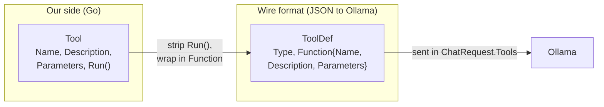
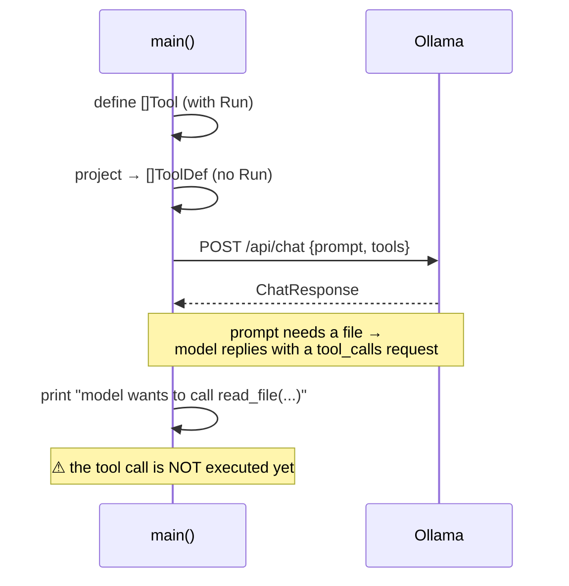

# Milestone 2 — Declaring Tools

> **New concept:** describe functions the model is allowed to call (`read_file`, `write_file`) and send those descriptions with the request.
>
> **Builds on:** [Milestone 1](./milestone-1.md) — same single HTTP call. The only change is *what we put in the request*.

A plain LLM can only produce text. To *do* things — read a file, write a file — it needs **tools**: functions we expose and describe to the model. In this milestone we **declare** the tools and ship their schemas in the request. We do **not** yet execute them — that's Milestone 3.

The prompt this time is `"Read the file demo.txt and tell me what it contains."` — a task the model *cannot* answer without a tool. So instead of plain text, the model replies with a **tool call**: "run `read_file` with `path: demo.txt`." We print that request and stop — we declared the tool but have no code to run it. That dangling, un-executed call is exactly the gap Milestone 3 fills.

---

## What changed since Milestone 1

```diff
  type Message struct {
  	Role      string     `json:"role"`
  	Content   string     `json:"content"`
+ 	ToolCalls []ToolCall `json:"tool_calls,omitempty"`   // model can now ask to call tools
  }

  type ChatRequest struct {
  	Model    string    `json:"model"`
  	Messages []Message `json:"messages"`
  	Stream   bool      `json:"stream"`
+ 	Tools    []ToolDef `json:"tools,omitempty"`          // we advertise tools to the model
  }
```

Plus a cluster of new types that describe tools, and a slice of two concrete tools. Everything else — marshal, POST, unmarshal, print — is unchanged from Milestone 1.

---

## Two vocabularies: "what we run" vs "what we send"

This is the part that trips people up. There are **two** representations of a tool, for two different audiences.



**`Tool`** — our internal struct. It has a `Run func(args map[string]any) string` — the actual Go code that does the work.

```go
type Tool struct {
	Name        string
	Description string
	Parameters  json.RawMessage
	Run         func(args map[string]any) string  // the real behaviour
}
```

**`ToolDef`** — the JSON shape Ollama expects. It's a *description only*: name, description, parameter schema. It has **no `Run`** — you can't send a Go function over HTTP, and the model doesn't run the code anyway. It only decides *which* tool to call and *with what arguments*.

```go
type ToolDef struct {
	Type     string       `json:"type"`     // always "function"
	Function ToolFunction `json:"function"` // name + description + parameter schema
}
```

So the model sees the *menu* (`ToolDef`); we keep the *kitchen* (`Tool.Run`).

---

## The two tools

```go
tools := []Tool{
	{
		Name:        "read_file",
		Description: "Read the contents of a file",
		Parameters:  json.RawMessage(`{"type":"object","properties":{"path":{"type":"string"}},"required":["path"]}`),
		Run: func(args map[string]any) string {
			path, _ := args["path"].(string)
			data, err := os.ReadFile(path)
			if err != nil {
				return fmt.Sprintf("error: %v", err)
			}
			return string(data)
		},
	},
	{
		Name:        "write_file",
		Description: "Write content to a file",
		Parameters:  json.RawMessage(`{"type":"object","properties":{"path":{"type":"string"},"content":{"type":"string"}},"required":["path","content"]}`),
		Run: func(args map[string]any) string {
			path, _ := args["path"].(string)
			content, _ := args["content"].(string)
			if err := os.WriteFile(path, []byte(content), 0644); err != nil {
				return fmt.Sprintf("error: %v", err)
			}
			return "ok"
		},
	},
}
```

The `Parameters` field is a [JSON Schema](https://json-schema.org/) — it tells the model the argument names, types, and which are required. This is how the model knows to pass `path` (and, for writing, `content`).

Note the `Run` functions **return their error as a string** rather than panicking. That's intentional: a tool result is just text fed back to the model, so "error: no such file" is a perfectly good thing to tell it.

---

## Building the wire format

Before sending, we project each `Tool` down to a `ToolDef` — dropping `Run`, keeping the description:

```go
toolDefs := make([]ToolDef, len(tools))
for i, t := range tools {
	toolDefs[i] = ToolDef{
		Type: "function",
		Function: ToolFunction{
			Name:        t.Name,
			Description: t.Description,
			Parameters:  t.Parameters,
		},
	}
}
```

Then attach them to the request:

```go
chatRequest := ChatRequest{
	Model:    "llama3.2",
	Messages: []Message{{Role: "user", Content: prompt}},
	Stream:   false,
	Tools:    toolDefs,   // ← the only new field vs Milestone 1
}
```

---

## The flow



Because the prompt (`"Read the file demo.txt..."`) can't be answered from the model's own knowledge, the reply comes back as a **tool call**, not text. `msg.Content` is usually empty; the request lives in `msg.ToolCalls`. We surface it and exit — the request is now *tool-aware* and the model is actively asking to act, but nothing runs it. Wiring up the actual call-and-respond cycle is the next step.

---

## The gap this leaves

The model **did** ask to call a tool — we printed the request and bailed. There's no code that:

1. looks at `msg.ToolCalls`,
2. finds the matching `Tool`,
3. runs `Tool.Run(args)`,
4. sends the result back so the model can continue.

That call-execute-respond cycle, wrapped in a loop with memory, **is** Milestone 3.

---

## Run it

`demo.txt` must exist in the project root (where you run the binary).

```bash
go build -o ./milestone-2-bin ./milestone-2/
./milestone-2-bin
```

Expected: a line like `model wants to call read_file(map[path:demo.txt]) — but Milestone 2 does not run it`. The model asked to act; we don't. That's the cliffhanger Milestone 3 resolves.

Note this milestone logs to **stderr** (`slog.NewTextHandler(os.Stderr, ...)`) instead of stdout — handy for separating diagnostics from the model's actual answer on stdout.

---

| | |
|---|---|
| ← Previous | [Milestone 1 — One HTTP Call](../milestone-1/docs.md) |
| → Next | [Milestone 3 — The Agent Loop](../milestone-3/docs.md) |
