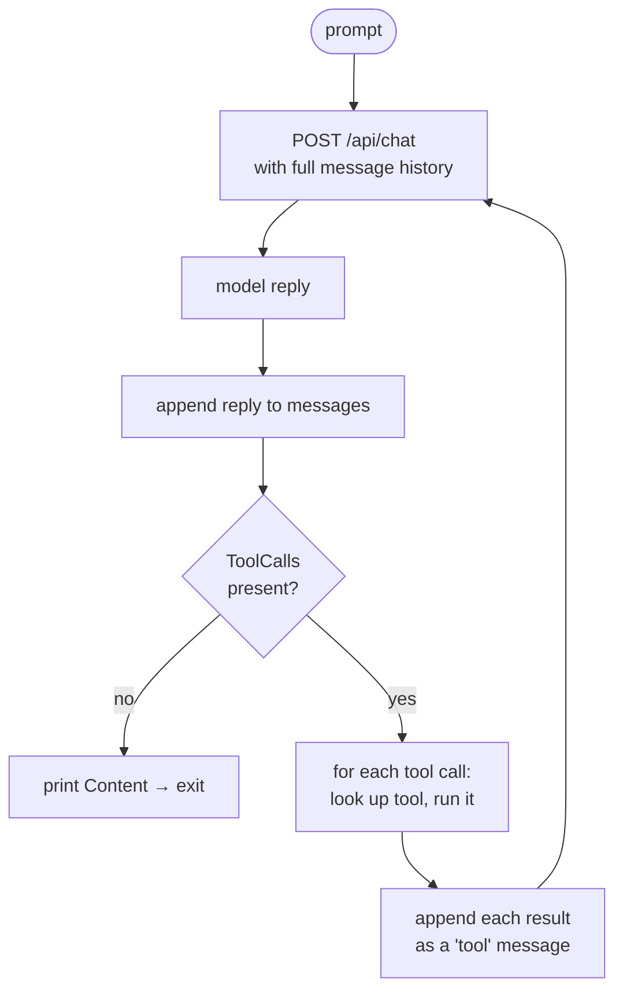
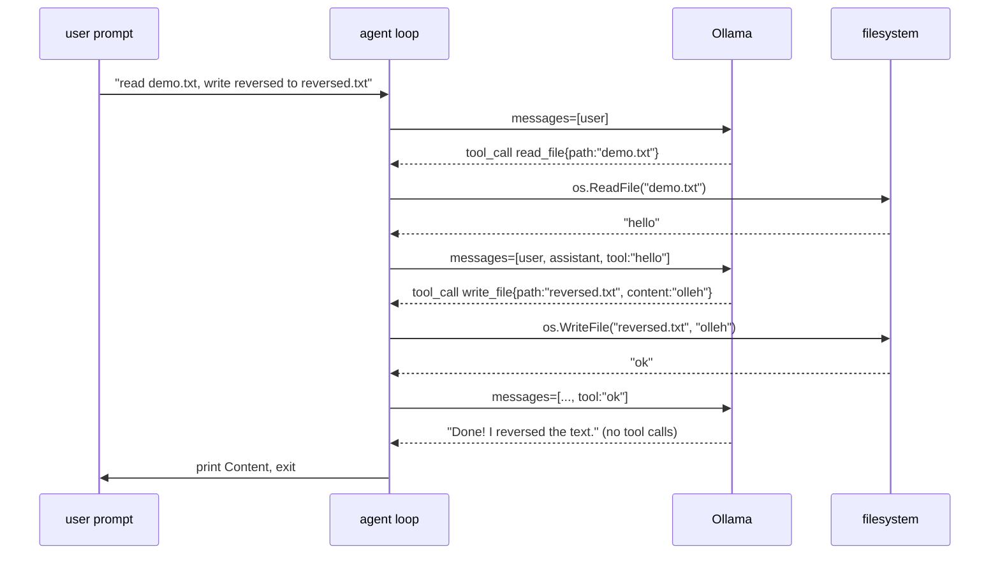

# Milestone 3 — The Agent Loop

> **New concept:** actually *run* the tools. Wrap the request in a `for` loop, dispatch each tool call, feed the result back, and keep the growing conversation as memory — until the model has no more tools to call.
>
> **Builds on:** [Milestone 2](./milestone-2.md) — same tools, same types. Milestone 2 *declared* tools; this milestone *executes* them in a loop.

This is the milestone where the program becomes an **agent**: a system that takes an action, observes the result, and decides what to do next — repeatedly — without us scripting each step.

---

## The core idea: the agent loop

An agent is a loop over a conversation. Each turn, the model either:

- **calls tools** → we run them, append the results, loop again; or
- **answers in plain text** → it's done, print and stop.



The conversation slice (`messages`) **is** the agent's memory. Every reply and every tool result gets appended, so each new request carries the entire history. That's what lets the model say "I read the file, here are its contents, now I'll write the reversed version" across multiple turns.

---

## What changed since Milestone 2

Three additions, one tweak:

1. **The `for` loop** around the request (was a single call).
2. **A dispatch map** `toolsByName` for O(1) lookup of which tool to run.
3. **History accumulation** — `messages` grows every turn instead of being a fixed one-element slice.
4. **Tweak:** `ToolCallFunction.Arguments` is now `map[string]any` (was `string`), so we can pass the parsed args straight into `Tool.Run`.

```diff
  type ToolCallFunction struct {
  	Name      string         `json:"name"`
- 	Arguments string         `json:"arguments"`
+ 	Arguments map[string]any `json:"arguments"`   // parsed args, ready for Run()
  }
```

There's also a shared HTTP client with a timeout — a small robustness upgrade now that we make many calls:

```go
var httpClient = &http.Client{Timeout: 60 * time.Second}
```

The two tools (`read_file`, `write_file`) gain explicit argument validation (`if !ok || path == ""`) so a malformed call returns a readable error string instead of misbehaving.

---

## The dispatch map

Milestone 2 had a slice of tools. To *run* the one the model named, we need fast lookup by name:

```go
toolsByName := make(map[string]*Tool, len(tools))
for i := range tools {
	toolsByName[tools[i].Name] = &tools[i]
}
```

> **Note:** the README calls this "switch dispatch" — the implementation uses a **map** instead. Same idea (route a name to its handler), cleaner as the tool list grows.

---

## The loop, line by line

```go
prompt := "Read the file demo.txt, then write its contents reversed to reversed.txt"
messages := []Message{{Role: "user", Content: prompt}}

for {
	chatRequest := ChatRequest{
		Model: "llama3.2", Messages: messages, Stream: false, Tools: toolDefs,
	}
	// ... marshal, POST, read, unmarshal into `result` ...
```
Each iteration sends the **entire** `messages` history, not just the latest turn. The model is stateless between calls; the history *is* the state.

```go
	msg := result.Message
	messages = append(messages, msg)   // remember what the model said
```
Append the model's reply to memory before doing anything else.

```go
	if len(msg.ToolCalls) == 0 {
		fmt.Println(msg.Content)
		break                          // no tools requested → the agent is finished
	}
```
The **termination condition**: a reply with no tool calls means the model is talking to *us*, not asking for an action. Print and exit the loop.

```go
	for _, tc := range msg.ToolCalls {
		tool, ok := toolsByName[tc.Function.Name]
		if !ok {
			messages = append(messages, Message{Role: "tool",
				Content: fmt.Sprintf("error: unknown tool %q", tc.Function.Name)})
			continue
		}
		output := tool.Run(tc.Function.Arguments)
		messages = append(messages, Message{Role: "tool", Content: output})
	}
}
```
For each requested call: find the tool, run it, and append its output as a `"tool"` message. Unknown tool? Append an error message — the model can read it and adapt. Then the loop sends everything back and the model decides what's next.

---

## A concrete run: "reverse demo.txt into reversed.txt"



Notice the history growing on every arrow into Ollama. That accumulation is the whole trick.

---

## The role of `Role: "tool"`

Tool results go back with `Role: "tool"`, distinct from `"user"` and `"assistant"`. This tells the model "this text is the *output of a function you asked for*," not a new instruction from the human. Getting the role right is what keeps the conversation coherent.

---

## The catch this leaves (motivates Milestone 4)

This loop trusts the model completely. When it says "Done, I reversed the text," we believe it and exit. But an LLM is **probabilistic** — it might:

- drop or duplicate a character,
- not actually reverse the text,
- forget to write the file at all.

Nothing here checks. [Milestone 4](./milestone-4.md) adds a deterministic verification step before trusting that final answer — and feeds failures back into *this same loop* so the agent corrects itself.

---

## Run it

`demo.txt` must exist in the project root (where you run the binary).

```bash
go build -o ./milestone-3-bin ./milestone-3/
./milestone-3-bin
```

Expected: JSON logs of each turn, a freshly written `reversed.txt`, and a final confirmation line.

---

| | |
|---|---|
| ← Previous | [Milestone 2 — Declaring Tools](../milestone-2/docs.md) |
| → Next | [Milestone 4 — Verify the Output](../milestone-4/docs.md) |
