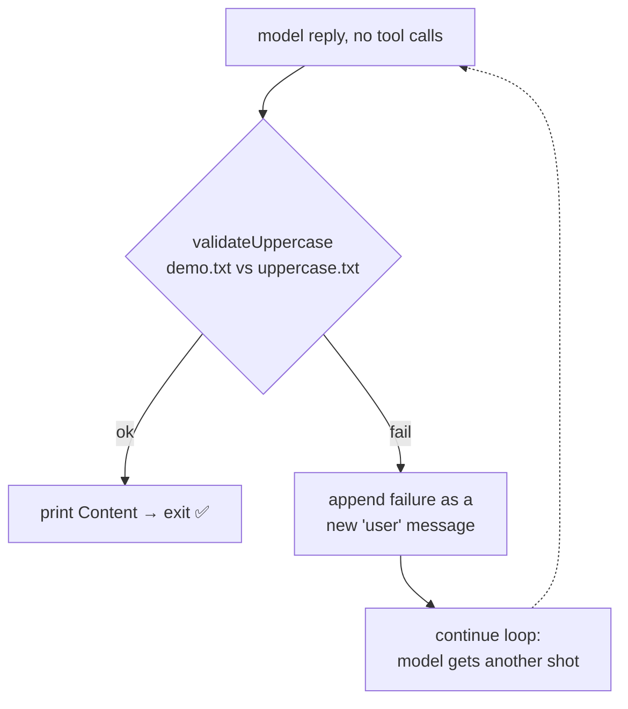
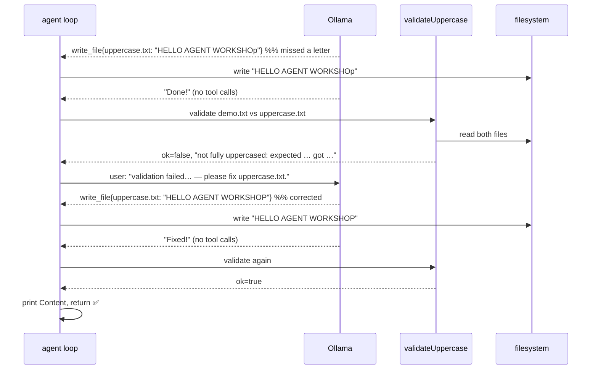

# Milestone 4 — Don't Trust the Model, Test It *(optional)*

> **New concept:** verify the model's output with a deterministic check, and feed failures back into the loop so the agent **self-corrects**.
>
> **Builds on:** [Milestone 3](./milestone-3.md) — same agent loop. This milestone inserts a verification gate at the one place Milestone 3 blindly trusted the model: its "I'm done" reply.

An LLM is **probabilistic**. "Uppercase this text" is a *request*, not a guarantee — the model may leave letters lowercase, alter a word, write a `$(...)` placeholder, or never write the file. With `llama3.2` this task succeeds only about **1 in 3** runs, so Milestone 3's "Done" is wrong most of the time. Milestone 3's loop believes it anyway. This milestone refuses to: it checks the result, and if the check fails, it hands the failure back as a new turn and lets the agent try again — and because each attempt is independent at ~1/3, retrying almost always lands a correct result within the turn budget.

This is the lesson that turns a demo into a real agent: **pair the loop with tests on the output.**

---

## What changed since Milestone 3

The loop body is identical *until* the model returns a no-tool-call reply. Milestone 3 printed and exited there. Milestone 4 inserts a gate:



Three things are new:

1. **`checkUppercase(original, output)`** — the deterministic test.
2. **`validateUppercase(srcPath, dstPath)`** — reads both files and runs the test.
3. **`maxTurns`** — a bound on the loop so a model that never converges can't run forever.

```diff
- for {                              // Milestone 3: unbounded
+ const maxTurns = 10
+ for turn := 0; turn < maxTurns; turn++ {   // Milestone 4: bounded
```

And the termination branch changes from *trust* to *verify*:

```diff
  if len(msg.ToolCalls) == 0 {
- 	fmt.Println(msg.Content)
- 	break
+ 	ok, feedback := validateUppercase("demo.txt", "uppercase.txt")
+ 	if ok {
+ 		fmt.Println(msg.Content)
+ 		return
+ 	}
+ 	messages = append(messages, Message{Role: "user",
+ 		Content: feedback + " — please fix uppercase.txt."})
+ 	continue
  }
```

---

## The check itself

```go
func checkUppercase(original, output string) []string {
	var failures []string
	if want := strings.ToUpper(original); output != want {
		failures = append(failures, fmt.Sprintf(
			"not fully uppercased: expected %q, got %q", want, output))
	}
	return failures
}
```

It asserts the property exactly: the output must equal the original with every letter uppercased. An empty slice means "passed."

Why an exact check, rather than a looser invariant like "same length"? Because uppercasing is **cheap to verify completely** — `strings.ToUpper` *is* the ground truth, so there's no reason to settle for less. (For a harder transform where you can't compute the right answer outright, you'd fall back to checking invariants — same length, same word count — which is its own useful exercise.) The slice return still pays off: `checkUppercase` returns *every* failure it finds, so when you add assertions (say, "must not be empty") they all get reported at once.

```go
func validateUppercase(srcPath, dstPath string) (ok bool, feedback string) {
	src, err := os.ReadFile(srcPath)
	if err != nil {
		return false, fmt.Sprintf("could not read source %s: %v", srcPath, err)
	}
	dst, err := os.ReadFile(dstPath)
	if err != nil {
		return false, fmt.Sprintf("could not read %s — did you write it? %v", dstPath, err)
	}
	original := strings.TrimRight(string(src), "\r\n")
	output := strings.TrimRight(string(dst), "\r\n")
	if failures := checkUppercase(original, output); len(failures) > 0 {
		return false, "validation failed: " + strings.Join(failures, "; ")
	}
	return true, ""
}
```

Two design choices worth copying:

- **It reads from disk**, not from the model's claim. The model can say anything; the file is ground truth.
- **It returns human-readable `feedback`.** That string isn't for our logs — it's the message we send *back to the model*. "validation failed: not fully uppercased: expected …, got …" is something the model can read and act on. A "did you write it?" hint even covers the case where the file is missing entirely.

The `TrimRight(..., "\r\n")` ignores trailing line endings (`\n` or Windows `\r\n`) on either side, so the check judges the content the model is responsible for, not file-ending conventions.

---

## Self-correction in action



The failure message re-enters the loop **as a `user` turn**, so to the model it reads like the human pointing out the mistake. The loop is unchanged — it's the same send/dispatch/append cycle from Milestone 3. We've just made one of its exits conditional on a test passing.

---

## Why `maxTurns`

Two forces can now drive the loop around: tool calls (as before) *and* failed validations. If the model can never produce a correct result, "fix it / still wrong" would spin forever. `maxTurns = 10` caps it; on exhaustion the program fails loudly:

```go
log.Fatalf("gave up after %d turns without passing validation", maxTurns)
```

A real agent always bounds its retries. Infinite self-correction is just an infinite loop with extra steps. (With a ~1/3 per-attempt success rate, the chance of burning all 10 turns is `(2/3)^10 ≈ 1.7%` — so in practice the agent converges, and `maxTurns` is the safety net, not the common path.)

---

## The payoff: tests with no Ollama, no network

Because the check lives in a plain function, it's unit-testable in isolation — no model, no HTTP:

```go
func TestCheckUppercasePasses(t *testing.T) {
	if failures := checkUppercase("hello agent workshop", "HELLO AGENT WORKSHOP"); len(failures) != 0 {
		t.Errorf("expected no failures, got %v", failures)
	}
}

func TestCheckUppercaseCatchesMissedLetter(t *testing.T) {
	if failures := checkUppercase("hello agent workshop", "HELLO AGENT WORKSHOp"); len(failures) == 0 {
		t.Error("expected a failure for the un-uppercased letter, got none")
	}
}
```

(`main_test.go` also covers *changed content*.) This separation — deterministic logic out of the probabilistic loop — is exactly what makes the agent testable.

```bash
go test ./milestone-4/      # fast, offline
```

---

## Run it

```bash
go build -o ./milestone-4-bin ./milestone-4/
./milestone-4-bin
```

Expected: the agent uppercases `demo.txt` into `uppercase.txt`. Because the first attempt is wrong roughly 2 of 3 times, you'll usually see one or more `validation failed` warnings in the logs, each followed by another attempt, then `validation passed` — the self-correction loop earning its keep.

---

## Takeaway

Verification is what turns a probabilistic model into a reliable system. The pattern generalizes far beyond uppercasing text:

> **Run the action → check the result deterministically → on failure, feed the failure back → bound the retries.**

Any agent you build for real should do all four.

---

| | |
|---|---|
| ← Previous | [Milestone 3 — The Agent Loop](../milestone-3/docs.md) |
| Back to start | [Milestone 1 — One HTTP Call](../milestone-1/docs.md) |
